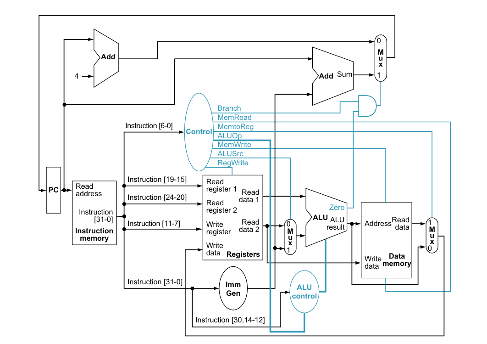

# RISC-V 32-bit Single-Cycle CPU (RV32I)

This repository contains a basic **32-bit RISC-V single-cycle processor** implementation, designed following the **classic Patterson & Hennessy single-cycle datapath** model.

The CPU executes one instruction per clock cycle and closely mirrors the textbook architecture in terms of components and dataflow.


## Overview

The processor is based on the **RV32I base integer instruction set** and includes:

Each instruction completes **fetch → decode → execute → memory → writeback** in **one clock cycle**, exactly as described in *Computer Organization and Design*.

> 

## Components
Here we're including the components as been shown in the book. that makes it easier for beginners to follow.

| Component | Description |
|---------|-------------|
| `SingleCycleCPU.sv` | Top-level CPU module |
| `InstrMem.sv` | Instruction memory (ROM/RAM) |
| `RegFile.sv` | 32×32-bit register file |
| `Imm_gen.sv` | Immediate generator |
| `CtrlUnit.sv` | Main control unit |
| `AluCtrl.sv` | ALU control logic |
| `Alu.sv` | Arithmetic Logic Unit |
| `MemData.sv` | Data memory |
| `mux2.sv` | Parameterized 2:1 multiplexer |
| `ALU_pkg.sv` | ALU operation definitions |


## supported Instructions (RV32I subset)

- **Arithmetic / Immediate**
  - `add`, `addi`
- **Branch**
  - `beq`
- **Memory**
  - `lw`, `sw` (if enabled in control logic)
- **Control**
  - PC + 4
  - Conditional branch

However, RV32M (mul/div), jumps (`jal`, `jalr`), and CSR instructions are **not yet implemented**.


## Build

We use a C++ driver, which is the easiest we found to keep things simple.

```c
make -C obj_dir -f VSingleCycleCPU.mk

./obj_dir/VSingleCycleCPU
```

# Run programs

 - You have offically simulated a CPU that you can run your own programs on.
 - What you saw when you ran the program is a hardcoded program stored in hex format instruction in the `InstrMem.sv` module. and you can modify it as well.
 - Note that register values and execution results can be displayed from `RegFile.sv` using `$display` statements in `RegFile.sv`.

## Example Program (Executed Successfully)

### sum in C
```c
int sum = 0;
for (int i = 1; i <= 5; i++) {
    sum += i;
}
return sum;


